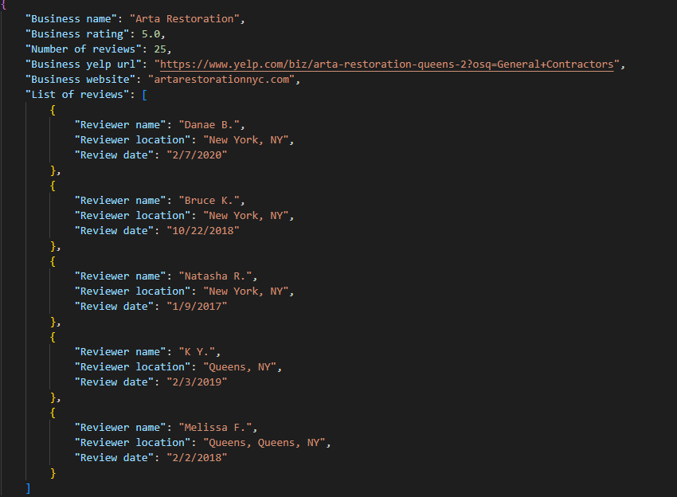

# Yelp Crawler
Crawler that scraps businesses from [Yelp](https://www.yelp.com/) website

# Installation
Python 3.10 must be already installed
```angular2html
git clone https://github.com/OvDima1/Crawler.git
pip install requirements.txt
```

# How to use
-> Run the spider
```angular2html
scrapy crawl businesses -O businesses.json
```
-> Input category name and location

# Examples of businesses

